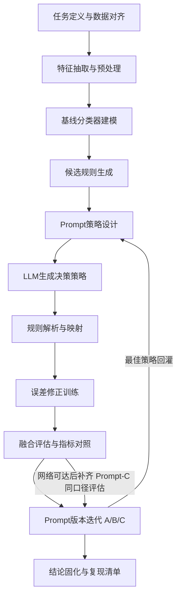

# 我们模型整体流程图

```mermaid
flowchart TD
    A[任务定义与数据对齐]
    B[特征抽取与预处理]
    C[基线分类器建模]
    D[候选规则生成]
    E[Prompt策略设计]
    F[LLM生成决策策略]
    G[规则解析与映射]
    H[误差修正训练]
    I[融合评估与指标对照]
    J[Prompt版本迭代 A/B/C]
    K[结论固化与复现清单]

    A --> B --> C --> D --> E --> F --> G --> H --> I --> J --> K
    I -->|网络可达后补齐 Prompt-C 同口径评估| J
    J -->|最佳策略回灌| E
```
